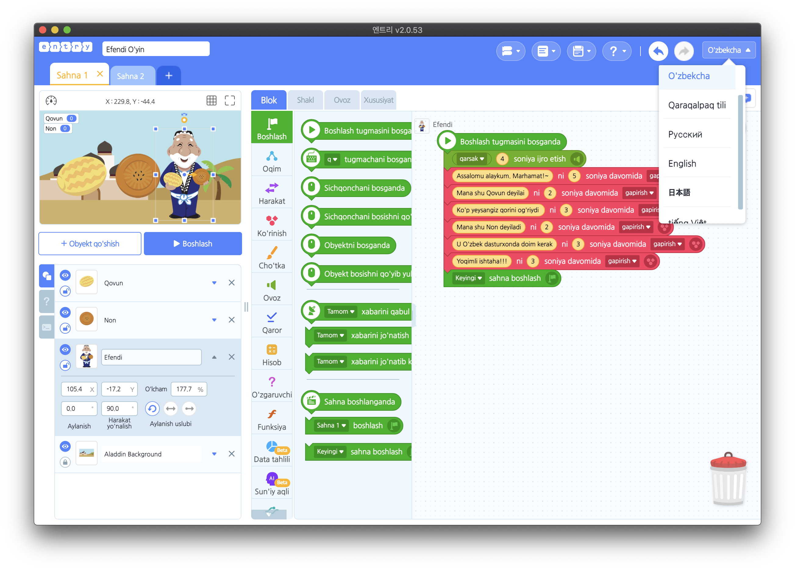
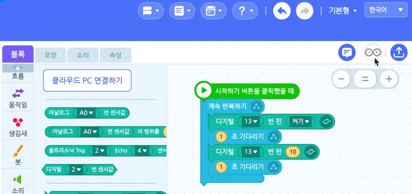
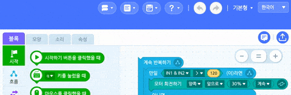
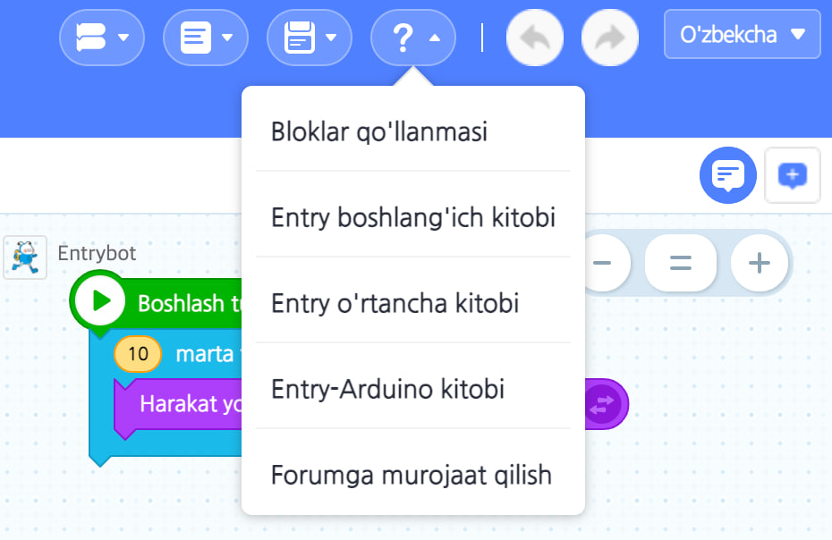

---
## 엔트리 오프라인 다국어 지원 버전은 무엇인가?
## Entry O'zbekcha versiyasi o'zi nima?
엔트리 오프라인 다국어 지원 버전은 [기존의 엔트리 오프라인 버전](https://github.com/entrylabs/entry-offline)이 한국어/영어만 지원하는 한계를 넘어, **다국어(우즈베키스탄어, 카라칼팍어, 러어, 일본어, 베트남어 등)로 코딩이 가능하도록 제작된 커스텀 버전**입니다. 코딩교육은 전 세계의 보편적인 공공재 입니다. 코딩교육을 잘하기 위해서는 교육에 활용가능한 도구들이 많으면 많을수록 좋습니다. **개도국에서도 우수한 한국의 코딩교육용 언어와 하드웨어들을 통해 더 풍성한 코딩교육을 할 수 있기를 기대합니다.**

Entry oʻzbekcha versiyasi [koreyadan ishlab chiqarilgan oldin mavjud entry oflayn versiya](https://github.com/entrylabs/entry-offline) ga o'zbekcha bilan qo'shimcha funksiyalarni kiritib o'zbek bolalarga mos bo'lishga tayyorlangan maxsus versiyadir. Dasturlash bo'yicha ta'lim butun dunyo bo'ylab universal jamoat manfaatidir. Dasturlash ta'limini yaxshi o'rgatish uchun ta'lim uchun qancha vositalar mavjud bo'lsa, shuncha yaxshi bo'ladi. **Umid qilamizki, rivojlanayotgan mamlakatlar da mana bu vositasi orqali yanada boy dasturlash taʼlimini taqdim eta oladilar.**

## 장점 (Yaxshi tomoni)
- 개도국 아이들이 **자국어**로 코딩할 수 있습니다.
 O'zbek bolalar **o'zning tili o'zbekcha** orqali dasturlash mumkin.
- 기존에 지극히 한국적인 오브젝트 외에 개도국 아이들 자국의 친숙한 전통 오브젝트(사람, 음식 등)들을 **기본으로 내장**시켜, 개도국 아이들이 친숙하게 코딩할 수 있도록 노력했습니다. :arrow_forward:[데모보기 (Namoiysh ko'rish)](http://naver.me/5PSfNscs)
Biz buni o'zbek bolalariga o'z mamlakatiga tanish bo'lgan **oldin o'rnatilgan** miliy obyektlar (odamlar, taomlar va boshqalar) dan foydalanishga imkoniyatni berishga harakat qildik.

>    
- 기존의 블록코딩의 Entry Python 외에도 **아두이노 블록코딩 한 내용을 아두이노 C++ 코드로 변환하기** 기능을 탑재해 아두이노의 실전 코딩을 가르치는 용도로도 활용 가능합니다. :arrow_forward:[데모보기 (Namoiysh ko'rish)](https://youtu.be/ZXWgiRx1mv0)
Mavjud blok kodlashni Python tiliga o'zgartirish uchun Entry-Python ga qo'shimcha ravishda, u **Arduino blok kodlashni Arduino C++ tiliga o'zgartirish** funksiyasi bilan jihozlangan, shuning uchun u Arduino ning haqiqiy kodlashni o'rgatish uchun ishlatilishi mumkin.

>  
- 코딩교육용 하드웨어 동작시키기 위해 **블록코딩 한 내용을 하드웨어로 업로드 시킨 이후 엔트리 없이도 하드웨어 스스로 동작가능 합니다.** (아두이노 외 특정 하드웨어 경우 개별 대응 필요!, 현재 지원 가능한 하드웨어는 아두이노, [네오피아 네오쏘코](https://www.neobot.co.kr/product/%EB%84%A4%EC%98%A4%EC%8F%98%EC%BD%94/223/category/74/display/1/), [잇플 바우카](https://animatojs.cafe24.com/shop2/product/%EC%97%94%ED%8A%B8%EB%A6%AC-%EC%BD%94%EB%94%A9%EB%A1%9C%EB%B4%87-%EB%B0%94%EC%9A%B0%EC%B9%B4/207/category/1/display/2/https://animatojs.cafe24.com/shop2/product/%EC%97%94%ED%8A%B8%EB%A6%AC-%EC%BD%94%EB%94%A9%EB%A1%9C%EB%B4%87-%EB%B0%94%EC%9A%B0%EC%B9%B4/207/category/1/display/2/)) :arrow_forward:[데모보기 (Namoiysh ko'rish)](https://www.youtube.com/watch?v=_9VuT8v359c)
Dasturlash bo'yicha ta'lim uchun maxsus qurilmani harakatlantirish uchun tuzgan **blokli kodlarni qurilmaga yuklagandan so'ng, qurilma Entry bilan ulanmasdan o'z-o'zidan ishlashi mumkin.** (Arduino dan boshqa maxsus uskuna bo'lsa, alohida javob talab qilinadi! Hozirda ishlatish mumkin bo'lgan qurilmalar Arduino, NEOPIA NEO SoCo, ITPle BOW Car)

> 
- 개도국 언어(우즈벡어 등)로 된 **[엔트리 기초교재](https://ufe.gitbook.io/entry)를 PDF 파일로 기본 내장**하여 초보자라도 설치 후 곧바로 사용법을 배울 수 있습니다.
**Oʻzbek tilidagi [Entry boshlang'ich darajali kitobi](https://ufe.gitbook.io/entry)ni PDF faylni Entry o'zi ichga ega**,  hatto yangi boshlanuvchilar ham oʻrnatishdan soʻng darhol undan qanday foydalanishni oʻrganishlari mumkin.

> 

## 개도국어(우즈벡어 등)로 코딩이 가능한 코딩교육용 하드웨어 목록 (O'zbek tilida kodlash mumkin bo'lgan dasturlash ta'limi uchun qurilmalar ro'yxati)
현재 개도국어(우즈벡어 등)로 코딩이 가능한 코딩교육용 하드웨어들은 **아두이노, 로보메이션의 햄스터/거북이, 네오피아의 네오쏘코** 이고, 계속 추가될 예정입니다. 추가가 필요하신 분은 연락부탁드립니다.
Hozirda oʻzbek tilida kodlash mumkin boʻlgan qurilmalar **Arduino, Robomation ning Hamster/Turtle, NEOPIA NEO SoCo** va boshqalar davom etib qoʻshilib ketadi. Agar sizga ko'proq kerak bo'lsa, biz bilan bog'laning.

>    

## 해야할 일 (Qolgan ishlarmiz)
- 각 코딩용 블럭에 대한 도움말을 개도국어(우즈벡어 등)로 번역하기
Har bir kodlash bloki uchun qo'llanmani oʻzbek tiliga tarjima qilish

## 문의/건의/이슈 (Murojaat/Taklif/Topgan muammolar bildirish)
- 문의/건의 등의 소통은 [Discussions](https://github.com/JeongJun-Lee/entry-offline/discussions)에 남겨주세요.
Murojaat/Takliflarni [shuyer](https://github.com/JeongJun-Lee/entry-offline/discussions)da qoldiring.
- 발견한 이슈는 [이슈 리스트(Issues)](https://github.com/JeongJun-Lee/entry-offline/issues)에 남겨주세요.
Topgan muammolarni [shuyer](https://github.com/JeongJun-Lee/entry-offline/issues)da qoldiring.
- 여러분의 기여는 언제든 환영합니다!!!
Sizlarning hissa qo'shishni doimo kutyapmiz!!!

## 도움을 주신 분들 (Yordam berganlar)
Durudona(블럭 번역), Gulshat(도움말 번역), 이주원(교정), 김사명(아두이노 번역), 이경선(전통 객체 이미지 제작), 홍의호(엔트리 교재 제작)

## Copyright and License
Licensed under the Apache License, Version 2.0 (the "License"); you may not use this file except in compliance with the License.  You may obtain a copy of the License at

    http://www.apache.org/licenses/LICENSE-2.0

Unless required by applicable law or agreed to in writing, software distributed under the License is distributed on an "AS IS" BASIS, WITHOUT WARRANTIES OR CONDITIONS OF ANY KIND, either express or implied. See the License for the specific language governing permissions and limitations under the License.
