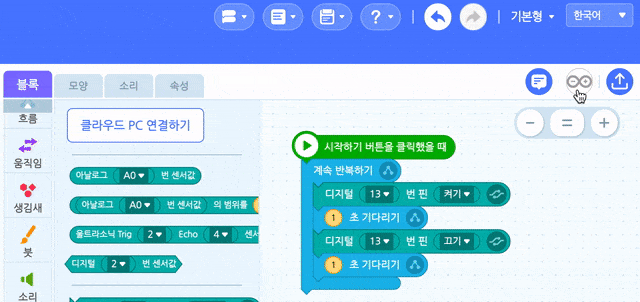

---
## 엔트리 오프라인 우즈벡어 지원 버전은 무엇인가?
엔트리 오프라인 우즈벡어 지원 버전은 [기존의 **엔트리 오프라인 버전**에 **우즈베키스탄어로 코딩이 가능**하도록 제작된 **커스텀 버전**]()입니다. 코딩교육은 전 세계의 보편적인 공공재 입니다. 코딩교육을 잘하기 위해서는 교육에 활용가능한 도구들이 많으면 많을수록 좋습니다. **개도국에서도 우수한 한국의 코딩교육용 언어와 하드웨어들을 통해 더 풍성한 코딩교육을 할 수 있기를 기대합니다.**

## 장점
- 우즈벡 아이들이 **자국어(우즈벡어)** 로 코딩할 수 있습니다.
- 자국에 친숙한 전통 객체(사람, 음식 등)들을 **기본으로 내장**시켜, 우즈벡 아이들에게 친숙하도록 노력했습니다. :arrow_forward:[데모보기](http://naver.me/5PSfNscs)
>    
- 기존의 블록코딩의 Entry Python 외에도 **아두이노 블록코딩 한 내용을 아두이노 C++ 코드로 변환하기** 기능을 탑재해 아두이노의 실전 코딩을 가르치는 용도로도 활용 가능합니다. :arrow_forward:[데모보기](https://youtu.be/ZXWgiRx1mv0)
>  
- 코딩교육용 하드웨어 관련 **블록코딩 한 내용을 하드웨어로 업로드** 시킨 후 이후 엔트리 없이도 하드웨어 스스로 동작가능 합니다. (아두이노 외 특정 하드웨어 경우 개별 대응 필요!, 현재 지원 가능한 하드웨어는 아두이노, 네오피아 네오쏘코) :arrow_forward:[데모보기](https://www.youtube.com/watch?v=_9VuT8v359c)
> 
- 우즈벡어로 된 [엔트리 기초교재](https://neopia-uz.gitbook.io/entry)를 PDF 파일로 기본 내장하여 초보자라도 설치 후 곧바로 사용법을 배울 수 있습니다.
> 

## 우즈벡어로 코딩이 가능한 코딩교육용 하드웨어 목록
현재 우즈벡어로 코딩이 가능한 코딩교육용 하드웨어들은 아두이노, 로보메이션의 햄스터/거북이, 네오피아의 네오쏘코 이고, 계속 추가될 예정입니다. 추가가 필요하신 분은 연락부탁드립니다.
>    

## 해야할 일 
- 엔트리 아두이노 블록코딩에 사용한 함수블록들도 아두이노 C++코드로 변환
- 각 코딩용 블럭에 대한 도움말을 우즈벡어로 번역하기

## 문의/건의/이슈/기여
- 문의/건의 등의 소통은 [Discussions](https://github.com/JeongJun-Lee/entry-offline/discussions)에 남겨주세요.
- 발견한 이슈는 [이슈 리스트(Issues)](https://github.com/JeongJun-Lee/entry-offline/issues)에 남겨주세요.
- 여러분의 기여는 언제든 환영합니다!!!

## 도움을 주신 분들
Durudona(블럭 번역), Gulshat(도움말 번역), 김사명(아두이노 번역), 이경선(전통 객체 이미지 제작), 홍의호(엔트리 교재 제작)

## Copyright and License
Licensed under the Apache License, Version 2.0 (the "License"); you may not use this file except in compliance with the License.  You may obtain a copy of the License at

    http://www.apache.org/licenses/LICENSE-2.0

Unless required by applicable law or agreed to in writing, software distributed under the License is distributed on an "AS IS" BASIS, WITHOUT WARRANTIES OR CONDITIONS OF ANY KIND, either express or implied. See the License for the specific language governing permissions and limitations under the License.
